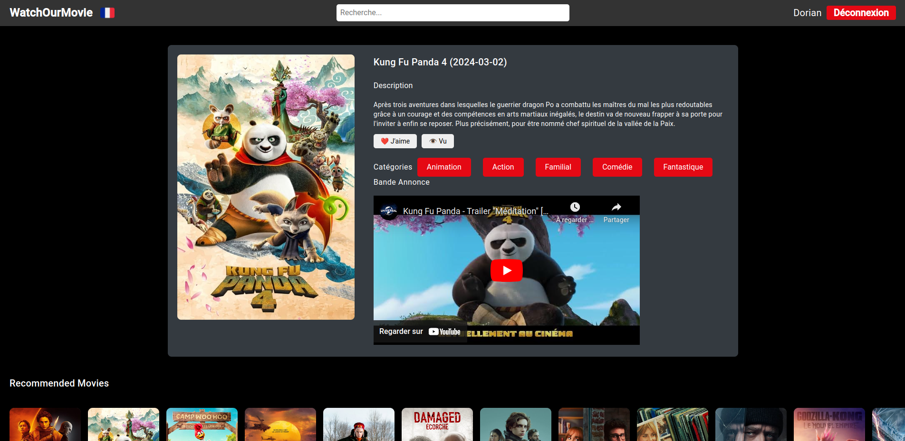

# WatchOurMovie (WOM)

WatchOurMovie est une application web qui propose aux utilisateurs des recommandations de films personnalisées en fonction de leurs préférences et de leur historique de visionnage.

## Architecture / Technologies utilisées


* **API** : FastAPI
* **Moteur de Recommandation** : Python
* **Frontend** : Angular
* **Caching** : module Python _cachetools_
* **Fournisseur d'Identité** : Python (JWT)
* **Gestion des Utilisateurs** : Python
* **Base de Données** : MySQL

## Fonctionnalités

* **Recommandations Personnalisées** : En utilisant un moteur de recommandation simplifié, WatchOurMovie suggère des films adaptés aux goûts de chaque utilisateur. (Le système recense tous les films présents sur le profil de l'utilisateur et récupère les 3 genres les plus représentés. On cherche ensuite sur TMDB 10 films pour chaque genre que l'utilisateur n'a jamais vu et on lui renvoie le tout en mélangeant le résultat)
* **Authentification et Autorisation des Utilisateurs** : L'authentification sécurisée des utilisateurs est gérée via Python avec gestion interne des JWT.
* **Caching Efficace** : Les requêtes sont mises en cache à l'aide de cachetools pour améliorer les performances et réduire les appels d'API redondants.
* **Gestion des Utilisateurs** : Les profils et préférences des utilisateurs sont gérés en interne.

## Prérequis
Avant de lancer l'application, assurez-vous d'avoir installé Docker et Docker Compose sur votre système.

Il vous faut aussi un `access token` pour l'API de TMDB à mettre dans le fichier `API/.env` dans la variable `TMDB_ACCESS_TOKEN`. 

Lien vers api TMDB pour générer un token access : [lien_doc_TMDB](https://developer.themoviedb.org/v4/docs/getting-started)


## Installation et utilisation

### Clonez ce dépôt Git sur votre machine locale en utilisant la commande suivante :
```bash
git clone https://github.com/Tarchaud/Projet_WatchOurMovie.git
```

### Naviguez vers le répertoire cloné :
```bash
cd Projet_WatchOurMovie/
```

### Lancer l'application :
```bash
docker-compose up --build
```

### Arrêter l'application :
Ctrl+C ou 
```bash
docker-compose down
```

### Supprimer le cache et les volumes
```bash
docker-compose down --rmi all -v
```

## Documentation de l'API

Après l'application lancer, il est possible d'accéder à la documentation de l'API via un des liens suivants :
- [http://localhost:8000/docs](http://localhost:8000/docs)
- [http://localhost:8000/redoc](http://localhost:8000/redoc)

## Screenshots

### Page d'accueil


### Informations sur un film



### Système de recherche interactif

